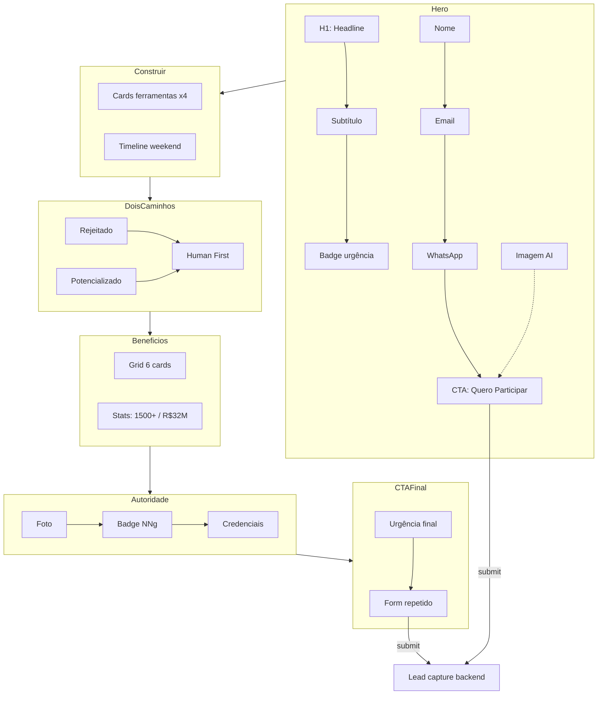

# Workshop Portfólio de IA e UX — Shaping Doc

> Documento gerado pelo **Agente UX Designer** seguindo a metodologia Shape Up (/shaping skill)
> Orquestrado por Claude Opus 4.6

---

## Frame

### Source (Briefing Original)
- Workshop imersivo de fim de semana para designers de UX
- Participantes criam um portfólio completo usando ferramentas de IA
- Público: UX designers que precisam se reciclar com IA
- Instrutor: Leandro Rezende, UX Master reconhecido pela Nielsen Norman Group
- Narrativa central: "Human First AI Design"
- Resultado: No domingo às 18h, portfólio pronto para transição de carreira

### Problem
- P1: Designers de UX estão sendo **rejeitados pelo mercado** por não saberem usar IA
- P2: Empresas acham (ingenuamente) que IA substitui UX — precisamos provar o contrário
- P3: Profissionais de UX com fundamentos sólidos não sabem como **potencializar** seu trabalho com IA
- P4: Falta um **portfólio atualizado** que demonstre domínio de IA + UX para conseguir vagas melhores
- P5: O mercado paga mais para quem domina as duas coisas, mas falta o caminho prático

### Outcome
- O1: Visitante qualificado se cadastra (nome + email + WhatsApp) para participar do workshop
- O2: Visitante entende em < 10 segundos o que é o workshop e o resultado prático
- O3: Visitante se identifica com a dor ("estou ficando para trás") e vê o workshop como solução
- O4: Taxa de conversão > 15% para uma landing page de captura

---

## Requirements

| ID  | Requirement | Status |
|-----|-------------|--------|
| R0  | Formulário de captura no topo da página (nome + email + WhatsApp) | Must-have |
| R1  | Promessa clara e forte visível em menos de 3 segundos (above the fold) | Must-have |
| R2  | Explicação objetiva do que é o workshop e o que acontece durante ele | Must-have |
| R3  | Resultado prático explícito: portfólio real, pronto, aplicável imediatamente | Must-have |
| R4  | Imagem sugestiva ao lado do formulário de captura (referência visual AI/UX) | Must-have |
| R5  | Benefícios destacados com dados concretos (números, resultados reais) | Must-have |
| R6  | Prova de autoridade do instrutor (NNg, 1500+ alunos, R$32M em salários) | Must-have |
| R7  | Narrativa "Human First AI Design" — IA potencializa, não substitui | Must-have |
| R8  | CTA repetido no final da página com urgência | Must-have |
| R9  | Mobile-first, totalmente responsivo | Must-have |
| R10 | Estética moderna AI/tech (dark mode, glassmorphism, gradientes) | Must-have |
| R11 | Carregamento rápido — sem frameworks pesados, HTML/CSS puro | Nice-to-have |
| R12 | Seção de FAQ ou objeções comuns | Nice-to-have |

---

## Shapes

### Shape A — Layout Linear Clássico de Conversão
Hero com formulário no topo → seções empilhadas verticalmente → CTA final.

**Parts:**
- A1: Hero section com grid 2 colunas (copy left, form right)
- A2: Seção "O que você vai construir" com cards de ferramentas
- A3: Seção narrativa "2 caminhos" com contraste visual
- A4: Grid de benefícios com ícones e números
- A5: Seção de autoridade com bio + credenciais
- A6: Detalhes do workshop (conteúdo + cronograma)
- A7: CTA final com formulário repetido
- A8: Footer

### Shape B — Sidebar Fixa de Captura
Formulário de captura fixo na lateral direita que acompanha o scroll. Conteúdo principal à esquerda.

**Parts:**
- B1: Sidebar sticky com formulário (visível em todo scroll)
- B2: Conteúdo principal em coluna única à esquerda
- B3: Seções empilhadas no conteúdo principal
- B4: Footer full-width

### Shape C — Storytelling Progressivo
Revelação gradual do conteúdo conforme scroll, com transições visuais entre seções. Formulário aparece apenas após a narrativa completa.

**Parts:**
- C1: Hero com apenas headline + "scroll para descobrir"
- C2: Seções com fade-in progressivo no scroll
- C3: Narrativa em storytelling contínuo
- C4: Formulário aparece somente no final
- C5: Footer

---

## Fit Check

| Requirement | Shape A (Linear) | Shape B (Sidebar) | Shape C (Story) |
|-------------|:-:|:-:|:-:|
| R0: Formulário no topo | ✅ | ✅ | ❌ |
| R1: Promessa em < 3s | ✅ | ✅ | ❌ |
| R2: Explicação objetiva | ✅ | ✅ | ✅ |
| R3: Resultado prático claro | ✅ | ✅ | ✅ |
| R4: Imagem ao lado do form | ✅ | ❌ | ❌ |
| R5: Benefícios com dados | ✅ | ✅ | ✅ |
| R6: Autoridade do instrutor | ✅ | ✅ | ✅ |
| R7: Narrativa Human First | ✅ | ✅ | ✅ |
| R8: CTA repetido no final | ✅ | ✅ | ✅ |
| R9: Mobile-first | ✅ | ❌ | ✅ |
| R10: Estética AI/tech | ✅ | ✅ | ✅ |
| R11: Carregamento rápido | ✅ | ✅ | ❌ |
| R12: FAQ | ✅ | ✅ | ✅ |

### Notes
- **Shape B / R4**: Sidebar ocupa o espaço da imagem. O formulário fica comprimido sem espaço para visual ao lado.
- **Shape B / R9**: Sidebar fixa não funciona em mobile — colapsa e quebra a experiência.
- **Shape C / R0 e R1**: O formulário só aparece no final. O visitante que chega pela primeira vez não vê o CTA de imediato. Altíssimo risco de bounce.
- **Shape C / R11**: Storytelling progressivo exige JavaScript para scroll-triggered animations, aumentando complexidade e peso.

### Decisão: **Shape A selecionado**

Shape A é o único que satisfaz **todos** os requirements Must-have. É o padrão comprovado de maior conversão para landing pages de captura — formulário visível imediatamente, fluxo previsível, funciona perfeitamente em mobile.

---

## Detail A — Parts Expandido

| Part | Descrição | Flag |
|------|-----------|------|
| A1: Hero | Grid 2 colunas. Esquerda: H1 + subtítulo + urgência. Direita: formulário (nome, email, whatsapp) + CTA "Quero Participar" + imagem decorativa de fundo | |
| A2: O Que Vai Construir | 4 cards com ferramentas (Figma, Make, Claude Code, Antigravity) + parágrafo sobre timeline (fim de semana, domingo 18h) | |
| A3: Dois Caminhos | Layout com 2 blocos contrastantes: "Caminho 1: Rejeitado" (vermelho/escuro) vs "Caminho 2: Potencializado" (azul/brilhante). Texto "Human First AI Design" como destaque | |
| A4: Benefícios | Grid 3×2 com ícone + título + descrição para cada benefício. Números em destaque (1500+, R$32M) | |
| A5: Autoridade | Foto placeholder do Leandro + badge NNg + lista de credenciais + números de impacto | |
| A6: Detalhes | Lista do conteúdo do workshop + cronograma visual + ferramentas utilizadas | |
| A7: CTA Final | Formulário completo repetido + headline de urgência + benefício final | |
| A8: Footer | Copyright + links de contato + política de privacidade | |

---

## Breadboard — UI Affordances

| ID | Affordance | Type | Place |
|----|-----------|------|-------|
| U1 | Headline principal | Text (H1) | Hero |
| U2 | Subtítulo | Text | Hero |
| U3 | Badge de urgência | Text/visual | Hero |
| U4 | Campo Nome | Input text | Hero Form |
| U5 | Campo Email | Input email | Hero Form |
| U6 | Campo WhatsApp | Input tel | Hero Form |
| U7 | Botão "Quero Participar" | Button/submit | Hero Form |
| U8 | Imagem decorativa AI | Image | Hero |
| U9 | Cards de ferramentas | Card grid (4) | Construir |
| U10 | Timeline do workshop | Visual/text | Construir |
| U11 | Bloco "Caminho Rejeitado" | Card escuro | Dois Caminhos |
| U12 | Bloco "Caminho Potencializado" | Card brilhante | Dois Caminhos |
| U13 | Texto "Human First" | Headline destaque | Dois Caminhos |
| U14 | Grid de benefícios | Cards (6) | Benefícios |
| U15 | Números em destaque | Stat cards | Benefícios |
| U16 | Foto do instrutor | Image placeholder | Autoridade |
| U17 | Badge NNg | Visual badge | Autoridade |
| U18 | Lista de credenciais | List | Autoridade |
| U19 | Detalhes do conteúdo | Accordion/list | Detalhes |
| U20 | Formulário final | Form (duplicate of U4-U7) | CTA Final |
| U21 | Headline de urgência final | Text (H2) | CTA Final |

---

## Breadboard — Wiring

---

## Non-UI Affordances

| ID | Affordance | Type |
|----|-----------|------|
| N1 | Lead capture endpoint | Form submission handler |
| N2 | Validação HTML5 | Input validation (required, type) |
| N3 | Google Fonts loader | External resource |
| N4 | CSS animations engine | Keyframes + transitions |

---

## Slices (para implementação)

| Slice | Conteúdo | Demo |
|-------|----------|------|
| V1: CSS Foundation | Design tokens, reset, tipografia, animações base | Página dark com tipografia correta |
| V2: Hero + Form | Hero section completa com formulário funcional | Formulário captura acima da dobra |
| V3: Conteúdo Seções | Todas as seções de conteúdo (Construir, Caminhos, Benefícios, Autoridade, Detalhes) | Scroll completo da página |
| V4: CTA Final + Footer | Formulário duplicado + footer | Página completa ponta a ponta |
| V5: Polish | Responsividade, animações refinadas, acessibilidade | Experiência final em desktop e mobile |

---

*Documento gerado seguindo a metodologia Shape Up, adaptada para trabalho com LLM via /shaping skill.*
*Agente: UX Designer | Orquestrador: Claude Opus 4.6*
